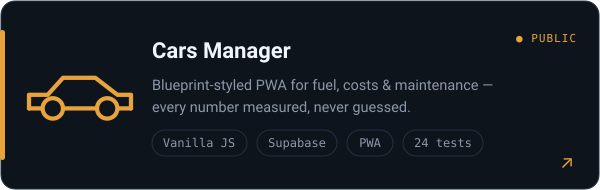
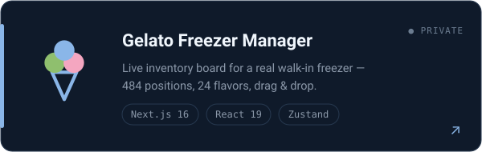
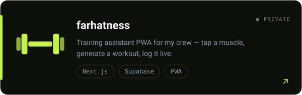
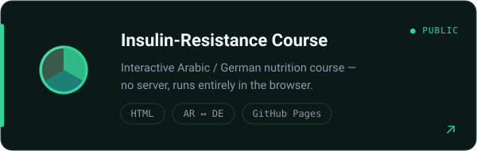
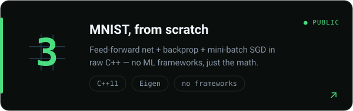

  

 

### 👋 Hi, I'm Abdallah

I like taking messy, real-world things — a car's stack of fuel receipts, a gelato shop's walk-in freezer, my friends' workout plans — and turning them into software that actually gets used. Based in **Erlangen, Germany**.

---

## 🛠️ What I've built

<table>
  <tr>
    <td width="50%">
      
    </td>
    <td width="50%">
      
    </td>
  </tr>
  <tr>
    <td width="50%">
      
    </td>
    <td width="50%">
      
    </td>
  </tr>
  <tr>
    <td width="50%">
      
    </td>
    <td width="50%">
      
    </td>
  </tr>
</table>

## 🧭 How I build

- **Measured, not guessed** — numbers come from odometers, receipts and reps, not estimates.
- **Domain first** — I model the real freezer / car / body before writing any UI.
- **Pure logic, tested** — the tricky math lives in framework-free functions with unit tests.
- **No build step where none is needed** — vanilla ES modules when they're enough, Next.js when they're not.

## 🧰 Toolbox

---

  ⚡ The cursor in the last card is still blinking for the next idea.

